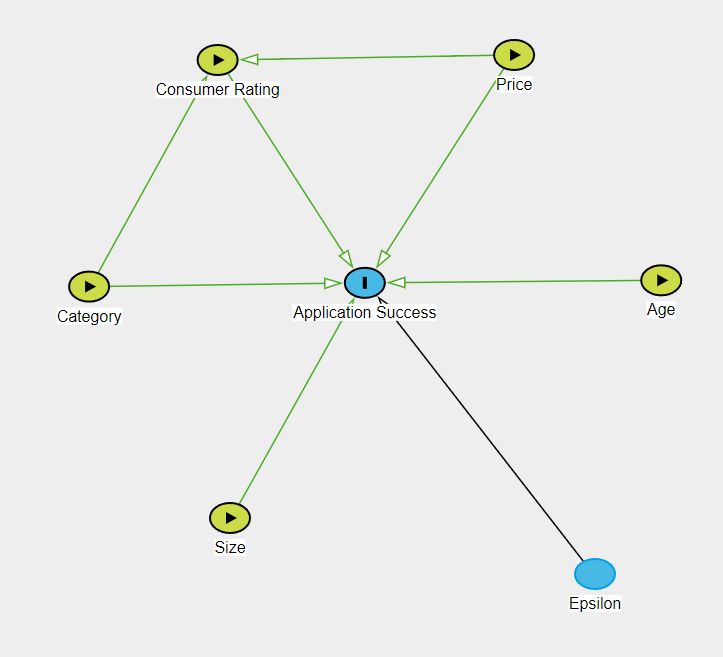
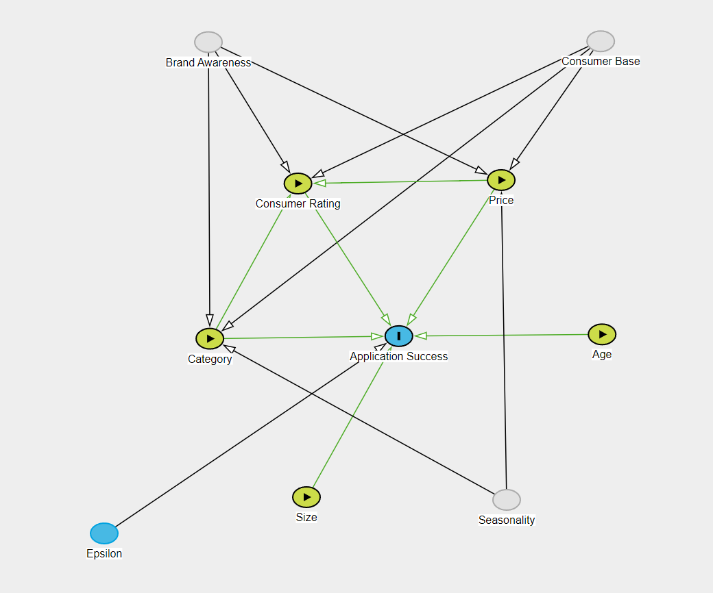

```{r setup, include=FALSE} 
knitr::opts_chunk$set(warning = FALSE, message = FALSE, fig.pos = 'H') 
options(tinytex.verbose = TRUE)
```

\tableofcontents

\section{Introduction}

\par
In 2020, Statista [reported](https://www.statista.com/statistics/271644/worldwide-free-and-paid-mobile-app-store-downloads/) a total of ~220 billion mobile application downloads globally. Another [study](https://buildfire.com/app-statistics/) found that approximately 70% of all digital media in the United States is spent on mobile applications. As digital applications become one of the principal media through which organizations engage with their customers, it becomes increasingly valuable to understand the drivers that lead to greater usage and better customer experience.

\par
The Google Play Store is one of the major hubs for Android mobile phone and tablet applications. Users can download any application on the Google Play Store for personal consumption across a wide range of categories. Making an application stand out in a sea of thousands of competing applications is no trivial task, however. To succeed, developers must carefully consider factors such as price, application size, and genre. Another variable that may be critical to an application's success is consumer rating. Today, smart algorithms play a key role in suggesting applications to consumers, creating a feedback loop that propels certain applications towards success and leaves others behind. An understanding of the relationship between consumer rating and application success would be incredibly valuable to developers seeking to create the next viral application.

\par
The following study is a causal analysis of the relationship between consumer rating and application success. Using a data set scraped directly from the Google Play Store, we will build a linear model that assesses the importance (or lack of importance) of consumer rating on the number of downloads, with additional variables such as price, application size, and application category serving as controls. If we confirm the existence of a causal pathway, it would signal that application developers should invest heavily in improving their ratings, for instance by buying positive reviews from consumers. Our study may also be of interest to Google, who has a vested interest in preventing developers from unfairly inflating their ratings.

\par
Given our prior beliefs on what factors motivate individuals to download applications, we believe there are omitted variables not included in our data set that may influence application success. These include brand awareness from marketing campaigns, differences across customer bases, seasonality, and production value, among possible others. In spite of these limitations, our study should provide useful insight into the factors that cause an application's success.

\par
The paper is structured as follows. Section 2 outlines our research question, the causal model we will use to contextualize our regression analysis, and the research design. Section 3 describes our data, the explanatory variables we will include in the modeling phase, and the transformations we will apply. Section 4 contains our statistical models, and Section 5 discusses their significance as well as their statistical validity. In Section 6, we present our conclusions and discuss the implications of our results.

\section{Research Question}

The goal of this study is to assess the causal factors of application success. Specifically, we seek to determine if there is a statistically significant relationship between consumer rating and application success. In the ensuing sections, we will answer the following question:

>\textit{Does higher consumer rating lead to greater success for Google Play Store applications?}

\section{Causal Theory}
Before we can discuss our data and research design, we must first describe the causal model which will serve as the reference point for our analysis. We also identify several omitted variables that could impact our results.

\subsection{Simple Causal Model}
We identify five factors that bear causal influence on the success of an application. These are (1) consumer rating, (2) price, (3) category, (4) age, and (5) size. Our proposed causal graph is shown below.

{#image1 .class width=50%}

\subsubsection{Application Success}
The goal of our analysis is to identify causal factors of application success, and more specifically to assess whether consumer rating has a positive effect on application success. There are different ways in which we could operationalize application success; our study will use raw download count as a surrogate, since it directly measures the number of consumers that made the decision to download an application. Although this choice ignores other potential aspects of success, such as revenue or social impact, it is effective in its simplicity and appropriate for this study.

\subsubsection{Consumer Rating}
The main independent variable of interest is consumer rating. We hypothesize that higher ratings should cause greater application success, because an application that has been highly rated is one that has been deemed worthwhile by other users. When consumers decide whether or not to download an application, they will likely trust the opinions of their peers and download applications with positive reviews. Conversely, we expect applications with negative ratings to have less success, since other users have judged them poorly. There should not be causal pathways leading from consumer rating to any of the other explanatory variables, since they are determined during the development phase of the application whereas consumer rating is decided once the application is published to the Google Play Store.
\par
Although we have not included it in the diagram, there is the possibility that a reverse causal pathway exists from application success to consumer rating. Successful applications are those that are enjoyable to a large number of consumers. Therefore, it is possible that users will rate applications with high download counts higher than applications with low download counts because they are primed to believe that such applications are better—otherwise, the successful applications would not have received so many downloads. Generally, we expect the reverse pathway to be weaker than the forward one. If ratings and downloads both have positive effects on one another, however, our models may suffer from positive feedback. We will discuss the implications of this effect in Section 5.

\subsubsection{Price}
We expect price to also have a causal effect on application success. Overall, we believe that paid applications should be more successful than free applications because they will have more appealing features. Of course, this may not always be the case, as free applications could also have impressive features and paid applications may lazily try to cash out on naive users. 
\par
We also anticipate a causal pathway from price to rating, for similar reasons as the pathway from price to success. Specifically, we believe that consumers are likely to rate paid applications positively since those applications have more desirable features, whereas free applications will be reviewed more negatively by comparison. Again, this relationship could lean in the opposite direction if our assumption about the connection between price and application quality is incorrect.

\subsubsection{Category}
\par
The category that an application belongs to is likely to affect its success. Certain categories of applications appeal to broad audiences and are more likely to find success than applications which appeal to a smaller subset of consumers. This interaction may not necessarily be so straightforward, however. If an application belongs to a popular category, then it also has to compete with other applications in the same category, which may in fact be detrimental to its success. Meanwhile, applications belonging to niche categories could have a greater chance of achieving success simply due to the fact that they have fewer competitors. Globally, we expect that the most successful applications will belong to popular categories, but that moderately successful applications will be spread across different categories. 
\par
Category is also a predictor of consumer rating. Due to stylistic and functional differences between application categories, it is likely that they are reviewed against different criteria. For example, a consumer reviewing a mobile game may place emphasis on the graphics, the fluidity of the controls, and the balance of the game mechanics, among others. A lifestyle application, on the other hand, will probably be judged on completely different features, such as ease of use, relevance in every day life, and usefulness. If review criteria depend on application category, then consumer ratings assuredly do too. It is difficult to predict in advance what categories are positively or negatively associated with consumer ratings, though we expect categories with narrower consumer bases to receive harsher ratings. Categories that may lead users to feel frustrated, such as games and dating applications, may also receive more negative reviews on average.

\subsubsection{Age}
\par
If we are to interpret application success in terms of the number of downloads an application accumulates, then the age of an application is necessarily an influential factor. Applications can only receive more downloads as time passes, so the longer an application remains on the Google Play Store, the more downloads it is likely to have. As an example of why this is important, consider two applications: one that was uploaded one year ago, and one that was uploaded one week ago. The older application receives 100 downloads a month for the whole year while the newer application receives 1,000 downloads in one week. If we were to only compare the raw download counts (1200 to 1000), it would seem as if the older application was more successful. By bringing age into the analysis, we are able to compare the applications by download rate instead of count, thus realizing that the newer application is far more successful than its older counterpart.
\par
We do not expect age to have causal effects on the other explanatory variables, though it might be possible to argue that consumer rating and price are affected by age. Unless our analysis clearly demonstrates otherwise, we will assume these effects are negligible.

\subsubsection{Size}
\par
We foresee two opposing sides to the relationship between application size and success. The first is a negative effect; given the limited space available on mobile and tablet devices, users may be more likely to download smaller applications. Alternatively, application size could be an indicator of production quality, in which case users may prefer larger applications over smaller ones. We hypothesize that the first effect takes precedence.

\subsubsection{Epsilon}
Epsilon represents variables which may influence application success but are independent from the other variables in our causal graph. For instance, these could include geographical location, the type of device (Android, iPhone, etc.) used to download an application, or the time of day at which a download occurs. Crucially, we assume that there do not exist any directed paths from epsilon to any of the five explanatory variables. This guarantees independence and is necessary for ordinary least-squares regression to be valid.

\section{Data}
To answer our research question, we will leverage publicly available data about applications available on the Google Play Store. This data was randomly scraped from the Google Play Store interface and uploaded to Kaggle.com in 2019. It contains key information about sampled applications, such as downloads, file size, consumer rating, category, and price. In total, the data contains records of about 10,000 applications. 

\par
For the modeling phase, we will use ordinary least-squares (OLS) regression. OLS regression is the plug-in estimator for the best linear predictor of a dependent random variable given the joint distribution of a set of independent random variables. Although OLS regression is often used with the goal of making predictions on new data, we will instead use it to answer a causal question about the relationship between variables. By interpreting model coefficients within the context of our causal theory, we will develop a statistically valid argument that addresses the research question.

\par
In our case, the dependent variable is application success and the independent variables are the predictors included in our causal model—consumer rating, price, category, age, and size. Unfortunately, the fields in our data set do not map exactly onto these variables, so we will approximate them using the following operationalizations:

\subsection{Dependent variable}

* Application success — `installs` (the accumulated number of downloads since the application was uploaded to the Google Play Store)

\subsection{Independent variables}

* Consumer rating — `rating` (the average consumer rating for the application out of 5)
* Price — `price` (the price of the application) and `type` (the price type of the application, free or paid)
* Category — `category` (the category tagged for the application, i.e Lifestyle, Game) and `content_rating` (the official content rating given to the application, i.e Teen, Everyone, Mature 17+)
* `size` — The memory space occupied by the application.
* Age — `current_version` (the current version number of the application) and `last_updated` (the date when the application was last updated)
* Size — `size` (the download size of the application, in units of MB)

\section{Research Design}
\par
The goal of this analysis is to determine the effect of consumer ratings on the success of Google Play Store applications. We hypothesize that higher consumer ratings lead to greater application success. To moderate and refine our analysis, we include four additional control variables: price, category, age, and download size. Price lets us differentiate between paid and free applications, while category lets us differentiate between different genres and target audiences. Age is included to account for the fact that applications which have been available in the store for a long time have an innate advantage over applications which were uploaded recently; with age as a variable, we can directly compare applications which were uploaded simultaneously. Finally, we include download size as it could be an indicator of production quality.
\par
Our data set offers a cross-sectional view of Google Play Store applications in 2019. Since not every feature maps directly to the variables we have defined in our causal framework, we make certain approximations (listed above). Although these mappings are sometimes imperfect, we believe they are sufficient for a meaningful analysis.
\par
Before we proceed with building any statistical models, we will conduct a thorough exploratory analysis of the data. We will note important patterns and trends in the data set, filter problematic entries and outliers, and justify necessary variable transformations. From there, we will build three models of increasing complexity and interpret the model coefficients, verify underlying assumptions, and discuss possible limitations. The first model will estimate how `installs` depends on `rating`, and will serve as a baseline for further analysis. The second model introduces control variables from our causal theory which we hypothesize have an effect on installations and consumer ratings. The third and final model explores interactions between `rating` and other explanatory variables. As justification for adding specific covariates, we will provide visualizations and conduct statistical tests that demonstrate their significance.

\section{Exploratory Data Analysis}

Prior to exploring the data, we create a few rules to filter and clean records based on logical conditions. This procedure involves removing duplicate records, removing records with null review counts, and removing records with consumer ratings greater than 5. Since our research question focuses on consumer rating, we elect to only keep records with valid values for that field. Intuitively, we do not believe that consumer rating is a suitable predictor if there are fewer than 100 ratings in total, so we only keep applications that exceed this amount. Although this step removes almost 25% of the data, it is acceptable given that the initial data set contains approximately 10,000 records. 

\par
After these initial operations, the cleaned data set contains 7,226 records (i.e distinct applications) with 24 metadata columns, 11 of which we built. We split up the exploration into two sections based on the type of the variable, numeric versus categorical. 

```{r setup environment, echo = FALSE}
#install.packages('GGally')
#install.packages('moments')
#install.packages("corrplot") 

# install.packages("DT")
# install.packages('GGally', repos='https://ftp.osuosl.org/pub/cran/')
# install.packages('moments', repos='https://ftp.osuosl.org/pub/cran/')
# install.packages("corrplot", repos = "http://cran.us.r-project.org")

library(GGally)
library(ggplot2) 
library(lmtest)
library(lubridate)
library(moments)
library(sandwich)
library(stargazer)
library(tidyverse)
library(data.table)
library(corrplot)
library(DT)
library(knitr)
library(kableExtra)
library(latex2exp)

# pull in functions
source('./functions/get_robust_se.R')
source('./functions/get_clean_dataset.R')
source('./functions/eda_calculate_stats_by_group.R')
source('./functions/eda_build_quantile_table.R')

knitr::opts_chunk$set(echo = TRUE)

# remove scientific notation
options(scipen = 999)
```

```{r load and clean data, echo = FALSE}
data_clean <- get_clean_dataset(minimum_review_count=0)
```

\subsection{Numeric Variables}

For the numeric variables, we wanted to understand each underlying distribution as well as examine the correlations and covariances among them. The distributions are used to measure the quality of the data, identify outliers, and evaluate the need for variable transformations. In addition, understanding the correlations between variables helps us to highlight those that might explain the variance of our dependent variable, and to quantify the level of collinearity between different features.

\subsubsection{Distributions}

``` {r distribution summary, echo = FALSE, results = "asis"}
numeric_cols <- c(
  'installs',
  'size',
  'reviews',
  'rating',
  'price',
  'current_version'
)

stargazer(
  data_clean[, numeric_cols],
  column.sep.width = "3pt",
  font.size = "small",
  header = FALSE
)
```

After the cleaning step, all feature values appear valid; there are no negative values, null values, or values close to infinity. Notably, only two fields contain zero values, `price` and `current_version`. This will be important when deciding whether or not to apply logarithmic transformations to any of the variables. We also note that we have treated `current_version` (the version of the application) as a metric variable. Although this is technically incorrect, we feel it is justified given this feature is ordinal in scale and has generally consistent intervals.

\par
From the differences between their medians and means, `size` and `reviews` appear to have approximately normal distributions, while the others have strong right or left skews. Since we expect a reverse causal pathway to exist from `installs` to `reviews` (i.e. high install counts lead to high review counts), we do not include `reviews` as a predictor in our analysis. 

**Application Success**

```{r echo = FALSE}
max_installs  <- max(data_clean$installs, na.rm = TRUE)
med_installs  <- median(data_clean$installs, na.rm = TRUE)
skew_installs <- skewness(data_clean$installs, na.rm = TRUE)
```

\par
Application success is measured using the `installs` feature, which represents the the raw download count of application. It is important to note here that `installs` is a binned feature. The bins start at 1 and scale logarithmically; 1+, 5+, 10+, 100+, 500+, 1000+, etc. For example, a value of 100+ means that an application has between 100 and 499 downloads. In the cleaning step, we removed the + sign and converted `installs` to a metric variable. This conversion is valid because the variable is ordinal and there is a measurable distance between bins. Given that this distance scales logarithmically, we can also claim that it is consistent between bins. Although there is some error in precision due to the fact that binning obscures the true value, we believe that `installs` can be treated as a metric variable in practice. The raw distribution has a strong right skew of $\tilde{\mu}_3 = `r signif(skew_installs, 3)`$; the maximum is `r signif(max_installs, 3)` and the median is `r signif(med_installs, 3)`. Unsurprisingly, applying a logarithmic transformation causes the resulting distribution to resemble a normal distribution, which makes it an appropriate transformation for future modeling.

``` {r distribution plots (installs), figures-side, fig.show = "hold", out.width = "50%", echo = FALSE}
ggplot(data = data_clean, aes(x = installs)) +
  geom_histogram() + 
  geom_density(aes(y=0.5*..count..)) + 
  geom_vline(xintercept = median(data_clean$installs)) +
  xlab("Installs") +
  ylab("Frequency") +
  ggtitle("Raw distribution of application install counts")

ggplot(data = data_clean, aes(x = log_installs)) +
  geom_histogram() +
  geom_density(aes(y=0.5*..count..)) + 
  geom_vline(xintercept = median(data_clean$log_installs)) +
  xlab(TeX("$\\log_{10}(installs)$")) +
  ylab("Frequency") +
  ggtitle("Log-distribution of application install counts")
```

**Consumer rating** 

```{r echo = FALSE}
max_rating  <- max(data_clean$rating, na.rm = TRUE)
med_rating  <- median(data_clean$rating, na.rm = TRUE)
skew_rating <- skewness(data_clean$rating, na.rm = TRUE)
```

\par
Consumer rating is measured using the `rating` feature, which represents the average consumer rating of an application. This feature appears to have a distribution that is approximately normal, but that is positively skewed towards larger values ($\tilde{\mu}_3 = `r signif(skew_rating, 3)`$). Average ratings range between 0 and 5, with a median of `r signif(med_rating, 3)`.

``` {r distribution plots (rating), figures-side, fig.show = "hold", out.width = "50%", echo = FALSE}
ggplot(data = data_clean, aes(x = rating)) +
  geom_histogram() + 
  geom_density(aes(y=0.5*..count..)) + 
  geom_vline(xintercept = median(data_clean$rating)) +
  xlab("Average consumer rating") +
  ylab("Frequency") +
  ggtitle("Raw distribution of average consumer rating")

ggplot(data = data_clean, aes(x = log_rating)) +
  geom_histogram() +
  geom_density(aes(y=0.5*..count..)) + 
  geom_vline(xintercept = median(data_clean$log_rating)) +
  xlab(TeX("$\\log_{10}(rating)$")) +
  ylab("Frequency") +
  ggtitle("Log-distribution average consumer rating")
```

**Size**

```{r echo = FALSE}
max_size  <- max(data_clean$size, na.rm = TRUE)
med_size  <- median(data_clean$size, na.rm = TRUE)
skew_size <- skewness(data_clean$size, na.rm = TRUE)
```

\par
Download size is measured using the `size` feature. `size` has a distribution that is slightly closer to normal than `installs`, though it still has a noticeable right-leaning tail ($\tilde{\mu}_3 = `r signif(skew_size, 3)`$). The maximum size in the data set is `r signif(max_rating, 3)`, and the median is `r signif(med_rating, 3)`. Applying a logarithmic transformation shifts the distribution closer to normality, leading us to conclude that it is an appropriate transformation. Although the log-distribution fluctuates near the middle, we still find it more appropriate than the raw distribution. 

``` {r distribution plots (size), figures-side, fig.show = "hold", out.width = "50%", echo = FALSE}
ggplot(data = data_clean, aes(x = size)) +
  geom_histogram() + 
  geom_density(aes(y=0.5*..count..)) +  
  geom_vline(xintercept = median(data_clean$size)) +
  xlab("Download size (MB)") +
  ylab("Frequency") +
  ggtitle("Raw distribution of application download size")

ggplot(data = data_clean, aes(x = log_size)) +
  geom_histogram() +
  geom_density(aes(y=0.5*..count..)) + 
  geom_vline(xintercept = median(data_clean$log_size)) +
  xlab(TeX("$\\log_{10}(size)$")) +
  ylab("Frequency") +
  ggtitle("Log-distribution of application download size")
```

**Price**

```{r echo = FALSE}
max_price  <- max(data_clean$price, na.rm = TRUE)
med_price  <- median(data_clean$price, na.rm = TRUE)
skew_price <- skewness(data_clean$price, na.rm = TRUE)
```

\par
Application price is measured using the `price` feature. In total, `r round(mean(data_clean$is_free), 2) * 100.0`% of applications in the data set are free to download; the median price is `r signif(med_price, 3)`, and the skew is $\tilde{\mu}_3 = `r signif(skew_price, 3)`$. As a result, we believe that neither the raw distribution nor the log-distribution of `price` are desirable for modeling, as they deviate too far from normality. Instead, we will transform `price` into an indicator variable that takes value 1 for paid applications and 0 for free applications.

``` {r distribution plots (price), figures-side, fig.show = "hold", out.width = "50%", echo = FALSE}

ggplot(data = data_clean, aes(x = price)) +
  geom_histogram() + 
  geom_density(aes(y=0.5*..count..)) + 
  geom_vline(xintercept = median(data_clean$price)) +
  xlab("Price ($)") +
  ylab("Frequency") +
  ggtitle("Raw distribution of application prices")

ggplot(data = data_clean, aes(x = log_price)) +
  geom_histogram() +
  geom_density(aes(y=0.5*..count..)) + 
  geom_vline(xintercept = median(data_clean$log_price)) +
  xlab(TeX("$\\log_{10}(price)$")) +
  ylab("Frequency") +
  ggtitle("Log-distribution of application prices")
```

**Age**

```{r echo = FALSE}
max_current_version  <- max(data_clean$current_version, na.rm = TRUE)
med_current_version  <- median(data_clean$current_version, na.rm = TRUE)
skew_current_version <- skewness(data_clean$current_version, na.rm = TRUE)
```

\par
The age of an application is measured using the proxy features `current_version` and `last_updated`. We notice that that `current_version` is skewed right ($\tilde{\mu}_3 = `r signif(skew_current_version, 3)`$), with a maximum value of `r signif(max_current_version, 3)` and a median of `r signif(med_current_version, 3)`. Due to the strong positive skew, we apply a logarithmic transformation before the modeling phase.

``` {r distribution plots (version), figures-side, fig.show = "hold", out.width = "50%", echo = FALSE}

ggplot(data = data_clean, aes(x = current_version)) +
  geom_histogram() + 
  geom_density(aes(y=0.5*..count..)) + 
  geom_vline(xintercept = median(data_clean$current_version)) +
  xlab("Current Version") +
  ylab("Frequency") +
  ggtitle("Raw distribution of application versions")

ggplot(data = data_clean, aes(x = log_current_version)) +
  geom_histogram() +
  geom_density(aes(y=0.5*..count..)) + 
  geom_vline(xintercept = median(data_clean$log_current_version)) +
  xlab(TeX("$\\log_{10}(current\\_version)$")) +
  ylab("Frequency") +
  ggtitle("Log-distribution of application versions")
```


\subsubsection{Correlations}

Aside from `log_reviews`, none of the other numeric features have a strong correlation with `installs`. The high correlation coefficient between `log_reviews` and `log_installs` supports our hypothesis that there is a causal path from `installs` to `reviews`; indeed, consumers will generally only review applications once they have downloaded them. Since one of our goals is to build an efficient model, we would ideally like to see stronger correlations between the independent variables and the dependent variable. There may be latent predictive power in the interactions between variables, however. Notably, we observe that the correlation coefficient between `rating` and `log_installs` increases by a factor of 2 when we exclude applications with fewer than 100 reviews. This agrees with our assumption that consumer rating bears causal influence on application success, and motivates our choice to remove applications with review counts of less than 100. Lastly, the correlation plots do not indicate high levels of collinearity among the numeric variables. 

``` {r correlation plots, figures-side, fig.show = "hold", out.width = "50%", echo = FALSE}
numeric_cols <- c(
  'log_installs',
  'log_reviews',
  'rating',
  'log_size',
  'is_free',
  'log_current_version',
  'log_last_updated'
)

corrplot(cor(data_clean[,numeric_cols], use = "complete.obs"), 
         method = 'number',
         mar=c(0,0,1,0), # http://stackoverflow.com/a/14754408/54964
         title = "All Applications")

#corrplot(cor(data_clean[data_clean$reviews >= 100,numeric_cols], use = "complete.obs"), 
#         method = 'number',
#         mar=c(0,0,1,0), # http://stackoverflow.com/a/14754408/54964
#         title = "Applications With at least 100 reviews (5th PCTL)")

corrplot(cor(data_clean[data_clean$reviews >= 100, numeric_cols], use = "complete.obs"), 
         method = 'number',
         mar=c(0,0,1,0), # http://stackoverflow.com/a/14754408/54964
         title = "Applications With at least 100 reviews (25th PCTL)")
```

\subsection{Categorical Variables}

For the categorical features, we want to aggregate the frequency and mean of `log_install` by feature sublabel. We use the mean as a measure of central tendency rather than the median given the approximately normal distribution of the `log_installs`. To identify which categorical features have the largest dispersion across sublabels, we calculate quantile tables using the average `log_installs` counts. We choose to exclude sublabels with fewer than 100 applications.

``` {r plots, echo = FALSE, results = 'asis'}

categorical_cols <- c(
  'category',
  'content_rating',
  'current_version',
  'android_version'
)

# perform function across all categorical columns 
table_long_cat <-
  rbindlist(lapply(
    categorical_cols,
    eda_calculate_stats_by_group,
    dt = as.data.table(data_clean)
  ))
table_quantile_cat <-
  rbindlist(
    lapply(
      categorical_cols,
      eda_calculate_stats_by_group,
      dt = as.data.table(data_clean),
      quantile_table = TRUE
    )
  )

kable(table_quantile_cat, caption = 'Quantile summary table', digits = 4, booktabs = T) %>%
  kable_styling(latex_options = "HOLD_position")

kable(table_long_cat[Variable == "category"], caption = 'Sublabel summary table, application category', digits = 4, booktabs = T) %>%
  kable_styling(latex_options = "HOLD_position")

kable(table_long_cat[Variable == "content_rating"], caption = 'Sublabel summary table, content rating', digits = 4, booktabs = T) %>%
  kable_styling(latex_options = "HOLD_position")

```

From the quantile summary table, all four categorical features have at least a 20% dispersion across the most frequent and least frequent sublabels. This indicates that these features might have some predictive power as inputs to a regression model. Notably, the `category` column seems to have the largest dispersion across groups, implying that it could be greatly impactful. We have omitted the table `android_version` as it is difficult to interpret. 

\par
Overall, this analysis motivates using `category` and `content_rating` as explanatory variables in regression models. To ease interpretability and limit the number of variables in our models, we will use binned and binary versions of these variables, isolating the sublabels with the highest frequencies.

\section{Statistical Models}

To address the impact of consumer ratings on the success of an application (number of installations), we use ordinary least squares regression to model logarithmically transformed `installs` against `rating`. Two more explanatory models build off of this basic model, and include additional variables as described in section 4.2. 

Based on our exploratory data analysis we decided on various interaction terms and transformations to use in our linear model. Our focus was to maximize its prediction accuracy (R^2) as well as maintaining a model that is explainable. The three models we tested are:

1) $log(installs) = \beta_0 + \beta_1 \:rating + \epsilon$

2) $log(installs) = \beta_0 + \beta_1 \:rating + \beta_2 \:log(size) + \beta_3 \:log(current\_version) + \beta_4 \:log(last\_updated) + \beta_5 \:is\_free + \beta_6 \:is\_family\_category + beta_7 \:is\_game\_category + beta_8 \:is\_tools\_category + beta_9 \:is\_content\_everyone + \epsilon$

3) $log(installs) = \beta_0 + \beta_1 \:rating + \beta_2 \:log(size) + \beta_3 \:log(current\_version) + \beta_4 \:log(last\_updated) + \beta_5 \:is\_free + \beta_6 \:is\_content\_everyone + beta_7 \:rating \cdot is\_family\_category  + beta_8 \:rating \cdot is\_game\_category + beta_9 \:rating \cdot is\_tools\_category + \epsilon$

```{r preliminary models, echo=FALSE}
model_small  <- lm(log_installs ~ 1 + rating, data = data_clean)
model_medium <- lm(log_installs ~ 1 + rating + log_size + log_current_version +
                     log_last_updated + is_free + is_family_category + 
                     is_game_category + is_tools_category + is_content_everyone,
                   data = data_clean)
model_large  <- lm(log_installs ~ 1 + rating + log_size + log_current_version +
                     log_last_updated + is_free + is_content_everyone +
                     rating * is_family_category + rating * is_game_category + 
                     rating * is_tools_category,
                   data = data_clean)

# plot(model_small)
# plot(model_medium)
# plot(model_large)
```


\section{Results}

In this section, we present the results of the three OLS regression models described in the Statistical Models section.

\subsection{OLS Regression Results}

Presented here are the regression results of the 3 models described in the Section 7. The dependent variable for these models is the logarithmic number of application installs on the Google Play store (`log_installs`) in 2019, based on the `installs` variable. 

```{r results = "asis", echo=FALSE}
# this should be table comparing regressions
stargazer(
  model_small,
  model_medium,
  model_large,
  header = FALSE,
  title = "Table 4: Model Comparison",
  type = "latex",
  se = list(get_robust_se(model_small), get_robust_se(model_medium), 
            get_robust_se(model_large)),
  column.sep.width = "3pt",
  font.size = "small",
  float = FALSE
)
```
From the regression results in Table 4., a few observations are particularly interesting. First, all coefficients are significant excluding two, `is_family_category` in Model 2, and `is_game_category` in Model 3. These variables were derived from the `category` variable in the raw dataset, which describes the category tagged for the application, i.e Lifestyle, Game, Tools, etc. Additionally, these `category` variables are also the only coefficients which alternate around 0 across the different models, adding confusion to the direction of correlation with `log_installs`. 

Considering these factors, the research team has decided that Model 2 is the best choice for this exercise. All coefficients in Model 2 (except for `is_family_category`) have a p-value < 0.01, and although the significance of Model 3 (${r^2} = 0.250$) is slightly better than Model 2 (${r^2} = 0.247$), Model 2 is more easily explainable, and has more significant and more consistent coefficients. Both models show that `rating` has around positive influence on `log_installs`, with each 1 unit increase corresponding to a ~30% increase in `log_rating`. These models generally agree with our hypothesis regarding the direction of correlation between each coefficient and the number of application installations. Finally, it is worthwhile to note that none of these models provide what would traditionally be excepted as a significant ${r^2}$ value, but given the extreme variability between types and end-use of applications available on the Google Play Store, as well as other uncontrolled factors, we believe that this model provides a useful description of how consumer rating may impact the success of an application. 

\section{Model Limitations}

\subsection{Statistical Limitations}
In the following section, we assess the five assumptions of the classic linear model: independence and identical distributions (I.I.D.), no perfect collinearity, linear conditional expectations, homoskedastic errors, and normally distributed errors.

\subsubsection{I.I.D.}
\par
According to the Kaggle authors, this data set was collected by randomly scraping the Google Play Store. Since no clusters of applications were specifically targeted, we can reasonably use the entire set of applications on the Google Play Store as our reference population. We recognize that applications likely have some degree of interdependence, especially within categories. For example, the success of one application likely has a negative impact on other applications of the same type. Due to the large size of this data set, however, we expect any dependencies to be negligible. We also have reason to believe that the data are identically distributed, as they are drawn from the same population of applications. One could argue that since the Google Play Store changes over time, the distribution also shifts in response. Because the authors make no specific mention of the time frame across which the data was collected, we will assume that they originate from a cross-sectional snapshot of the Google Play Store and that no shifts in the underlying distribution occurred during the sampling process.

\subsubsection{No Perfect Collinearity}
\par We can immediately conclude that the variables included in our models are not perfectly collinear, as otherwise the regressions above would have failed. We can also assess near perfect collinearity for these variables by observing the robust standard errors returned by the regression model. In general, highly collinear features will have large standard errors. Since the standard errors of the coefficients are small relative to their magnitude, we can reasonably conclude that they are not nearly collinear.

\subsubsection{Linear Conditional Expectations}
\par To verify the assumption of linear conditional expectations, we seek to show that there is no relationship between the model residuals and any of the predictor variables. That is, the model does not systematically underpredict or overpredict in certain regions of the input space. Figures <INSERT FIGURE TAGS> show the relationships between the model residuals and metric-scale predictors. The residuals are generally well-centered around zero, although the model seems to underpredict when `log_reviews` is high and `rating` is low. The fourth plot shows the model residuals as a function of the model predictions. Here, the model seems to underpredict in the left-most and right-most regions, and slightly overpredict in the middle. Overall, there are no strong non-linear relationships between the model residuals and the input features, so we do not find enough evidence to reject the assumption of linear conditional expectation.  

\subsubsection{Homoskedastic Errors}
\par When assessing homoskedastic errors, we seek to determine if there is a relationship between the variance of the model residuals and the predictors. If the homoskedastic assumption is satisfied, then we should observe a lack of relationship; conversely, if the data are heteroskedastic then the conditional variance will depend on the predictors. The first plot is an eyeball test of homoskedasticity, showing the model residuals as a function of the model predictions. We notice that the spread of the residuals is mostly consistent throughout the data, although the right-hand side is somewhat narrower. As a more concrete assessment, we also perform a Breush-Pagan test with the null hypothesis that there are no heteroskedastic errors in the model. Since the $p$-value falls below our significance threshold of 0.001, we find enough evidence to reject the null hypothesis. In response to this failed assumption, we report robust standard errors (adjusted for heteroskedasticity) instead of non-adjusted errors.

\subsubsection{Normally Distributed Errors}
\par When assessing the normality of the error distribution, we seek to determine if the model residuals are approximately Gaussian. If so, then the sample quantiles of the residuals should closely match the theoretical quantiles of a normal distribution in a Q-Q plot. Below, we plot the Q-Q plot associated with our model. In general, the residuals seem to follow a normal distribution, as the middle quantiles match the corresponding theoretical quantiles. However, the tails of the residual distribution are fatter than expected; the first quantiles occur at smaller than expected values, and the last quantiles occur at larger than expected values. Overall, the assumption of normally distributed errors seems imperfect but reasonably justified.

Because our data fails to meet the assumption of homoskedasticity, we adopt the large-sample assumptions (assumptions 1 and 2) instead. Specifically, we report robust standard errors rather than non-adjusted errors in our results.

\subsection{Structural Limitations of Our Model}
The true causal diagram is undoubtedly more complex than the one we have outlined above. We have identified several omitted variables that could affect our statistical models and any conclusions we infer from them, shown in the second causal diagram below. We discuss the relationships these omitted variables have with our existing variables and the ways in which they could bias our results.

{#image2 .class width=50%}

\subsubsection{Brand Awareness}
Brand awareness is the measure of how memorable and recognizable a brand is to its target audience. For our specific research question, we define this concept as the percentage of consumers, whom have the capability to download apps from the Google Play store, that are familiar with the brand. We believe brand awareness to be positively correlated with both consumer success and rating. Larger awareness expands the acquisition funnel for an organization's application leading to more installs. Organizations with quality products likely have more disposable cash for marketing and thus better awareness among consumers. This would make the bias direction positive which is the same direction of the rating coefficient as our model. Based on this reasoning, the bias would be away from zero and causing us to overestimate model coefficients.

\subsubsection{App Rankings}
Outside of the Google Play store user interface, we hypothesize brand awareness as an external factor that increases app downloads. An internal factor we believe that exists is the business logic defined by Google. Specifically how the company ranks apps in addition to the design in how they merchandise exploration for consumers. Thus, we think this factor can be operationalized through a numeric value representing its rank within its respective categories. Some categories may be further up in the scroll experience, thus the interaction between this value and category may capture this effect. We expect consumers to discover high ranked apps more easily making it positively correlated with install count. We also believe Google uses rating as a metric in defining the rank, hence that would also be positively correlated with ranking. This would make the bias direction positive which is the same direction of the rating coefficient as our model. Based on this reasoning, the bias would be away from zero and causing us to overestimate model coefficients.

\subsubsection{Total Addressable Market}
This variable relates to the opportunity of a product which is measured in either revenue or the number of customers that would be interested in the product. This varies based on the functionality of the product/service. For this omitted variable we are focusing on the number of available customers. We believe this is positively correlated with install count as it provides a larger funnel to acquire app downloads. We do not expect a very strong association with app rating, but would hypothesize a positive one. The larger the market, the more crucial it is the build a differentiated product with a quality experience. This would make the bias direction positive which is the same direction of the rating coefficient as our model. Based on this reasoning, the bias would be away from zero and causing us to overestimate model coefficients.

\section{Key Takeaways}

\subsection{Conclusion}
Earlier in this report, we hypothesized that higher consumer ratings will lead to greater application success, as described by the number of installations of an application on the Google Play store. The models produced from this analysis do agree with this hypothesis, and confirm that higher rated applications have more success on the store. Along with this conclusion, we found that free applications, newer applications, and larger (in terms of storage size) applications are also positive indicators for application installation. Unfortunately, these results have low confidence ($adj. {r^2} = 0.247$), leading to some uncertainty about the validity of the proposed model. Still, we believe that the lack of significance is largely due to omitted variable bias, general irregularity in the data due to human randomness, and other aspects, provide enough explanation to assume some level of trust in the outcome of this analysis.

\subsection{Discussion}

\section{Appendix}