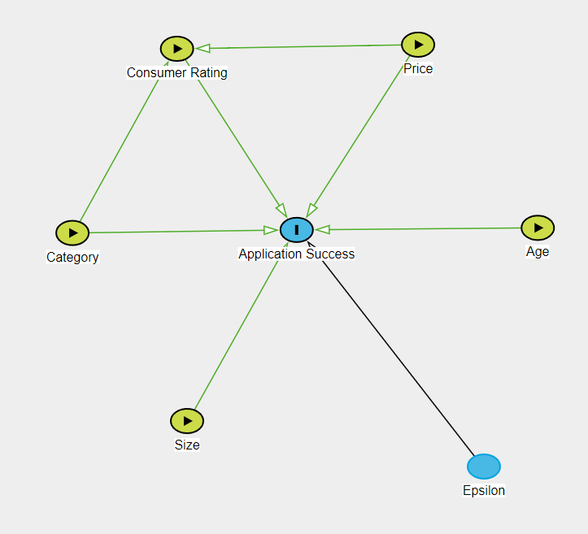
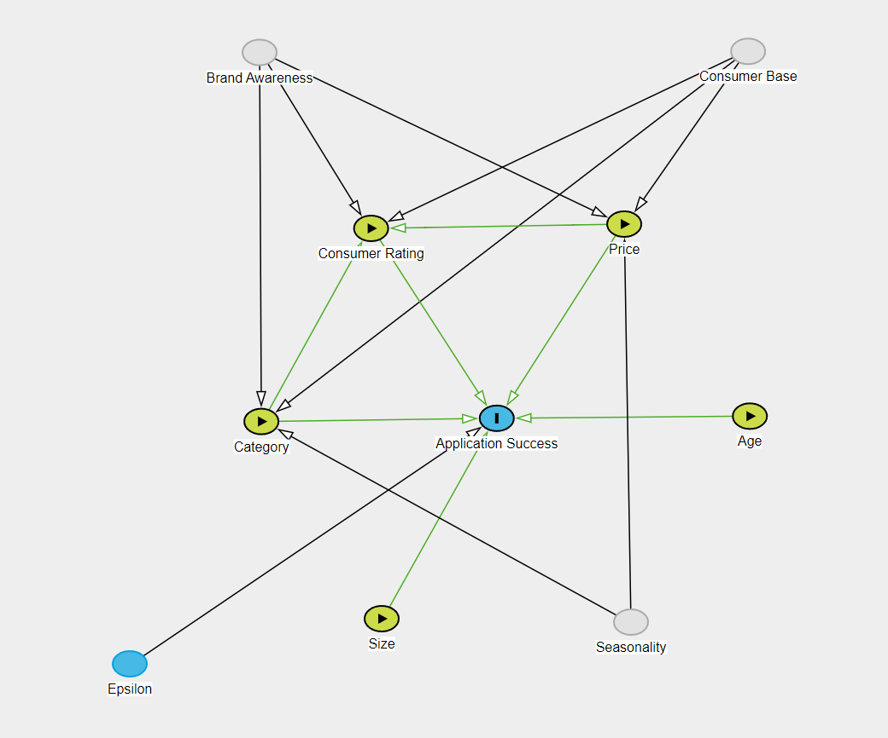

```{r setup, include=FALSE} 
knitr::opts_chunk$set(warning = FALSE, message = FALSE) 
options(tinytex.verbose = TRUE)
```

\tableofcontents

\section{Introduction}

\par
In 2020, Statista [reported](https://www.statista.com/statistics/271644/worldwide-free-and-paid-mobile-app-store-downloads/) a total of ~220 billion mobile application downloads globally. Another [study](https://buildfire.com/app-statistics/) found that approximately 70% of all digital media in the United States is spent on mobile applications. As digital applications become one of the principal media through which organizations engage with their customers, it becomes increasingly valuable to understand the drivers that lead to greater usage and better customer experience.

\par
The Google Play Store is one of the major hubs for Android mobile phone and tablet applications. Users can download any application on the Google Play Store for personal consumption across a wide range of categories. Making an application stand out in a sea of thousands of competing applications is no trivial task, however. To succeed, developers must carefully consider factors such as price, application size, and genre. Another variable that may be critical to an application's success is consumer rating. Today, smart algorithms play a key role in suggesting applications to consumers, creating a feedback loop that propels certain applications towards success and leaves others behind. An understanding of the relationship between consumer rating and application success would be incredibly valuable to developers seeking to create the next viral application.

\par
The following study is a causal analysis of the relationship between consumer rating and application success. Using a data set scraped directly from the Google Play Store, we will build a linear model that assesses the importance (or lack of importance) of consumer rating on the number of downloads, with additional variables such as price, application size, and application category serving as controls. If we confirm the existence of a causal pathway, it would signal that application developers should invest heavily in improving their ratings, for instance by buying positive reviews from consumers. Our study may also be of interest to Google, who has a vested interest in preventing developers from unfairly inflating their ratings.

\par
Given our prior beliefs on what factors motivate individuals to download applications, we believe there are omitted variables not included in our data set that may influence application success. These include brand awareness from marketing campaigns, differences across customer bases, seasonality, and production value, among possible others. In spite of these limitations, our study should provide useful insight into the factors that cause an application's success.

\par
The paper is structured as follows. Section 2 outlines our research question, the causal model we will use to contextualize our regression analysis, and the research design. Section 3 describes our data, the explanatory variables we will include in the modeling phase, and the transformations we will apply. Section 4 contains our statistical models, and Section 5 discusses their significance as well as their statistical validity. In Section 6, we present our conclusions and discuss the implications of our results.

\section{Research Question}

The goal of this study is to assess the causal factors of application success. Specifically, we seek to determine if there is a statistically significant relationship between consumer rating and application success. In the ensuing sections, we will answer the following question:

>\textit{Does higher consumer rating lead to greater success for Google Play Store applications?}

\section{Causal Theory}
Before we can discuss our data and research design, we must first describe the causal model which will serve as the reference point for our analysis. We also identify several omitted variables that could impact our results.

\subsection{Simple Causal Model}
We identify five factors that bear causal influence on the success of an application. These are (1) consumer rating, (2) price, (3) category, (4) age, and (5) size. Our proposed causal graph is shown below.

{#image1 .class width=50%}

\subsubsection{Application Success}
The goal of our analysis is to identify causal factors of application success, and more specifically to assess whether consumer rating has a positive effect on application success. There are different ways in which we could operationalize application success; our study will use raw download count as a surrogate, since it directly measures the number of consumers that made the decision to download an application. Although this choice ignores other potential aspects of success, such as revenue or social impact, it is effective in its simplicity and appropriate for this study.

\subsubsection{Consumer Rating}
The main independent variable of interest is consumer rating. We hypothesize that higher ratings should cause greater application success, because an application that has been highly rated is one that has been deemed worthwhile by other users. When consumers decide whether or not to download an application, they will likely trust the opinions of their peers and download applications with positive reviews. Conversely, we expect applications with negative ratings to have less success, since other users have judged them poorly. There should not be causal pathways leading from consumer rating to any of the other explanatory variables, since they are determined during the development phase of the application whereas consumer rating is decided once the application is published to the Google Play Store.
\par
Although we have not included it in the diagram, there is the possibility that a reverse causal pathway exists from application success to consumer rating. Successful applications are those that are enjoyable to a large number of consumers. Therefore, it is possible that users will rate applications with high download counts higher than applications with low download counts because they are primed to believe that such applications are better—otherwise, the successful applications would not have received so many downloads. Generally, we expect the reverse pathway to be weaker than the forward one. If ratings and downloads both have positive effects on one another, however, our models may suffer from positive feedback. We will discuss the implications of this effect in Section 5.

\subsubsection{Price}
We expect price to also have a causal effect on application success. Overall, we believe that paid applications should be more successful than free applications because they will have more appealing features. Of course, this may not always be the case, as free applications could also have impressive features and paid applications may lazily try to cash out on naive users. 
\par
We also anticipate a causal pathway from price to rating, for similar reasons as the pathway from price to success. Specifically, we believe that consumers are likely to rate paid applications positively since those applications have more desirable features, whereas free applications will be reviewed more negatively by comparison. Again, this relationship could lean in the opposite direction if our assumption about the connection between price and application quality is incorrect.

\subsubsection{Category}
\par
The category that an application belongs to is likely to affect its success. Certain categories of applications appeal to broad audiences and are more likely to find success than applications which appeal to a smaller subset of consumers. This interaction may not necessarily be so straightforward, however. If an application belongs to a popular category, then it also has to compete with other applications in the same category, which may in fact be detrimental to its success. Meanwhile, applications belonging to niche categories could have a greater chance of achieving success simply due to the fact that they have fewer competitors. Globally, we expect that the most successful applications will belong to popular categories, but that moderately successful applications will be spread across different categories. 
\par
Category is also a predictor of consumer rating. Due to stylistic and functional differences between application categories, it is likely that they are reviewed against different criteria. For example, a consumer reviewing a mobile game may place emphasis on the graphics, the fluidity of the controls, and the balance of the game mechanics, among others. A lifestyle application, on the other hand, will probably be judged on completely different features, such as ease of use, relevance in every day life, and usefulness. If review criteria depend on application category, then consumer ratings assuredly do too. It is difficult to predict in advance what categories are positively or negatively associated with consumer ratings, though we expect categories with narrower consumer bases to receive harsher ratings. Categories that may lead users to feel frustrated, such as games and dating applications, may also receive more negative reviews on average.

\subsubsection{Age}
\par
If we are to interpret application success in terms of the number of downloads an application accumulates, then the age of an application is necessarily an influential factor. Applications can only receive more downloads as time passes, so the longer an application remains on the Google Play Store, the more downloads it is likely to have. As an example of why this is important, consider two applications: one that was uploaded one year ago, and one that was uploaded one week ago. The older application receives 100 downloads a month for the whole year while the newer application receives 1,000 downloads in one week. If we were to only compare the raw download counts (1200 to 1000), it would seem as if the older application was more successful. By bringing age into the analysis, we are able to compare the applications by download rate instead of count, thus realizing that the newer application is far more successful than its older counterpart.
\par
We do not expect age to have causal effects on the other explanatory variables, though it might be possible to argue that consumer rating and price are affected by age. Unless our analysis clearly demonstrates otherwise, we will assume these effects are negligible.

\subsubsection{Size}
\par
We foresee two opposing sides to the relationship between application size and success. The first is a negative effect; given the limited space available on mobile and tablet devices, users may be more likely to download smaller applications. Alternatively, application size could be an indicator of production quality, in which case users may prefer larger applications over smaller ones. We hypothesize that the first effect takes precedence.

\subsubsection{Epsilon}
Epsilon represents variables which may influence application success but are independent from the other variables in our causal graph. For instance, these could include geographical location, the type of device (Android, iPhone, etc.) used to download an application, or the time of day at which a download occurs. Crucially, we assume that there do not exist any directed paths from epsilon to any of the five explanatory variables. This guarantees independence and is necessary for ordinary least-squares regression to be valid.

\subsection{Omitted Variables}
The true causal diagram is undoubtedly more complex than the one we have outlined above. We have identified several omitted variables that could affect our statistical models and any conclusions we infer from them, shown in the second causal diagram below. We discuss the relationships these omitted variables have with our existing variables and the ways in which they could bias our results.

{#image2 .class width=50%}

\textbf{Brand Awareness}

\textbf{Differences in Consumer Bases}

\textbf{Seasonality}


\section{Data}
To answer our research question, we will leverage publicly available data about applications available on the Google Play Store. This data was randomly scraped from the Google Play Store interface and uploaded to Kaggle.com in 2019. It contains key information about sampled applications, such as downloads, file size, consumer rating, category, and price. In total, the data contains records of about 10,000 applications. 

\par
For the modeling phase, we will use ordinary least-squares (OLS) regression. OLS regression is the plug-in estimator for the best linear predictor of a dependent random variable given the joint distribution of a set of independent random variables. Although OLS regression is often used with the goal of making predictions on new data, we will instead use it to answer a causal question about the relationship between variables. By interpreting model coefficients within the context of our causal theory, we will develop a statistically valid argument that addresses the research question.

\par
In our case, the dependent variable is application success and the independent variables are the predictors included in our causal model—consumer rating, price, category, age, and size. Unfortunately, the fields in our data set do not map exactly onto these variables, so we will approximate them using the following operationalizations:

\textbf{Dependent variable}

* Application success — `installs` (the accumulated number of downloads since the application was uploaded to the Google Play Store)

\textbf{Independent variables}

* Consumer rating — `rating` (the average consumer rating for the application out of 5)
* Price — `price` (the price of the application) and `type` (the price type of the application, free or paid)
* Category — `category` (the category tagged for the application, i.e Lifestyle, Game) and `content_rating` (the official content rating given to the application, i.e Teen, Everyone, Mature 17+)
`size` — The memory space occupied by the application.
* Age — `current_version` (the current version number of the application) and `last_updated` (the date when the application was last updated)
* Size — `size` (the download size of the application, in units of MB)


\section{Research Design}
\par
The goal of this analysis is to determine the effect of consumer ratings on the success of Google Play Store applications. We hypothesize that higher consumer ratings lead to greater application success. To moderate and refine our analysis, we include four additional control variables: price, category, age, and download size. Price lets us differentiate between paid and free applications, while category lets us differentiate between different genres and target audiences. Age is included to account for the fact that applications which have been available in the store for a long time have an innate advantage over applications which were uploaded recently; with age as a variable, we can directly compare applications which were uploaded simultaneously. Finally, we include download size as it could be an indicator of production quality.
\par
Our data set offers a cross-sectional view of Google Play Store applications in 2019. Since not every feature maps directly to the variables we have defined in our causal framework, we make certain approximations (listed above). Although these mappings are sometimes imperfect, we believe they are sufficient for a meaningful analysis.
\par
Before we proceed with building any statistical models, we will conduct a thorough exploratory analysis of the data. We will note important patterns and trends in the data set, filter problematic entries and outliers, and justify necessary variable transformations. From there, we will build three models of increasing complexity and interpret the model coefficients, verify underlying assumptions, and discuss possible limitations. The first model will estimate how `installs` depends on `rating`, and will serve as a baseline for further analysis. The second model introduces control variables from our causal theory which we hypothesize have an effect on installations and consumer ratings. The third and final model explores interactions between `rating` and other explanatory variables. As justification for adding specific covariates, we will provide visualizations and conduct statistical tests that demonstrate their significance.

\section{Exploratory Data Analysis}

Prior to exploring the variables built a few rules to filter clean data. Some of which included removing duplicates, records with a null review count (`reviews`), or records with a consumer rating (`rating`) value of larger than 5. Our research question focuses on consumer rating, thus only kept records with a corresponding valid value for it. We intuitively do not believe the consumer rating score is representative if there are less than 100 reviews. But, we wanted to first understand the distribution before making a dramatic reduction in sample size of the data set. The cleaned data set includes 7,226 rows (i.e applications) with 24 metadata columns (11 of which we built). We split up the exploration into 2 sections based on variable type; numeric versus categorical. 

```{r setup environment, echo = FALSE}
#install.packages('GGally')
#install.packages('moments')
#install.packages("corrplot") 

#install.packages('GGally', repos='https://ftp.osuosl.org/pub/cran/')
#install.packages('moments', repos='https://ftp.osuosl.org/pub/cran/')
#install.packages("corrplot", repos = "http://cran.us.r-project.org") 

library(GGally)
library(ggplot2) 
library(lmtest)
library(lubridate)
library(moments)
library(sandwich)
library(stargazer)
library(tidyverse)
library(data.table)
library(corrplot)

# pull in functions
source('./functions/get_robust_se.R')
source('./functions/get_clean_dataset.R')
#source('./functions/eda_calculate_stats_by_group.R')
source('./functions/eda_build_quantile_table.R')

knitr::opts_chunk$set(echo = TRUE)

# remove scientific notation
options(scipen = 999)
```

```{r load and clean data, echo = FALSE}
data_clean <- get_clean_dataset(minimum_review_count=0)
```

\subsection{Numeric Variables}

For the numeric variables, we wanted to understand the distribution of each as well as examine the correlations/covariances among them. The distribution is used to measure the quality of the data, understand outliers, and evaluate the need for variable transformations. Understanding correlations help in highlight variables that may help explain the variance of our dependent variable as well as determine collinearity among our independent variables, which we want to avoid. When evaluating the correlation coefficients we used the rule of thumbs where >= 0.9 is great and >= 0.6 is okay. 

\subsubsection{Distribution of Variables}

``` {r distribution summary, echo = FALSE}
numeric_cols <- c(
  'installs',
  'size',
  'reviews',
  'rating',
  'price'
)

summary(data_clean[,numeric_cols])
```
The column values all seem valid given there were no negative values (i.e negative review count) or a number near infinity. Notably, none contained any zero values which would be an important note if we'd want to take the log transformation of a variable.
\par

Based on the difference across medians and means, size and rating count appear to have more normal distributions while the others look more conducive to having a long tail in either end of their spectrum. Notably, we expect there to be a reverse causal link between install count and review count (i.e high install count leads to review count). Based on this we elected to not include review count as an independent variable. Based on the distribution our initialy idea of only keeping applications with at least 100 reviews seems sensible as it will only remove 25% of the data which is okay given the initial size of over 7k apps. 
\par


``` {r distribution plots (installs), echo = FALSE}
ggplot(data = data_clean, aes(x = installs)) +
  geom_histogram() + 
  geom_vline(xintercept = median(data_clean$installs)) +
  xlab("Install Count") +
  ylab("Frequency") +
  ggtitle("Distribution of Install Count")

ggplot(data = data_clean, aes(x = log_installs)) +
  geom_histogram() +
  geom_vline(xintercept = median(data_clean$log_installs)) +
  xlab("Log of Install Count") +
  ylab("Frequency") +
  ggtitle("Distribution of Log of Install Count")
```

**Application success**: Important to note is the installs count variable is binned. The bins start at one and scale logarithmically; 1+, 5+, 10+, 100+, 500+, 1000+, etc (i.e 100+ means there are between 100 and 499 installs for that app). We simply removed the `+` and made treated it as a metric variable. We know the variable is ordinal as there is a clear ordering to it. We concluded it is metric because there is a measurable distance between groups. And, given the distance between groups scales logarithmically, we can claim there is a constant distance across groups. There is some error with precision as the bin hides the true value, but we believe this variable can be considered metric in practice. There is a heavy tail towards the end of the spectrum as the maximum is 1 billion with a median of 100,000. Unsurprisingly, taking a log of the variable allows resemble a normal distribution making this an appropriate variable transformation for the model.

``` {r distribution plots (rating), echo = FALSE}
ggplot(data = data_clean, aes(x = rating)) +
  geom_histogram() + 
  geom_vline(xintercept = median(data_clean$rating)) +
  xlab("Consumer Rating") +
  ylab("Frequency") +
  ggtitle("Distribution of Consumer Rating")

ggplot(data = data_clean, aes(x = log_rating)) +
  geom_histogram() +
  geom_vline(xintercept = median(data_clean$log_rating)) +
  xlab("Log of Consumer Rating") +
  ylab("Frequency") +
  ggtitle("Distribution of Log of Consumer Rating")
```

**Consumer rating**: The rating variable appears to have a distribution that appears approximately normal that is skewed towards the right of the valid values between 0 and 5 with a median of 4.3. 

``` {r distribution plots (size), echo = FALSE}
ggplot(data = data_clean, aes(x = size)) +
  geom_histogram() + 
  geom_vline(xintercept = median(data_clean$size)) +
  xlab("Size (in MB)") +
  ylab("Frequency") +
  ggtitle("Distribution of Size (in MB)")

ggplot(data = data_clean, aes(x = log_size)) +
  geom_histogram() +
  geom_vline(xintercept = median(data_clean$log_size)) +
  xlab("Log of Size (in mb)") +
  ylab("Frequency") +
  ggtitle("Distribution of Log of Size (in mb)")
```

**Size**: The size variable had slightly more normal distribution than installs count, but still had a heavy tail towards the end of its spectrum. The log of size more closely resembles a normal distribution leading us to believe it will be an appropriate variable transformation. Note, the log(size) value does not have a very pronounced high density point near the mean/median, but we believe it still is appropriate when comparing it to the distribution of the non-logged version. 

``` {r distribution plots (price), echo = FALSE}

ggplot(data = data_clean, aes(x = price)) +
  geom_histogram() + 
  geom_vline(xintercept = median(data_clean$price)) +
  xlab("Price") +
  ylab("Frequency") +
  ggtitle("Distribution of Price")

ggplot(data = data_clean, aes(x = log_price)) +
  geom_histogram() +
  geom_vline(xintercept = median(data_clean$log_price)) +
  xlab("Log of Price") +
  ylab("Frequency") +
  ggtitle("Distribution of Log of Price")

```

**Price**: `r round(mean(data_clean$is_free),2)*100`% of the applications are free. This is why believe both distributions of price and log(price) are undesirable where neither mimic a normal distribution at all. This finding lead to us exploring the concept of a binary metric variable where 1 means it is paid and 0 means it is not paid. 

\subsubsection{Correlation of Variables}

``` {r correlation plots, echo = FALSE}
numeric_cols <- c(
  'reviews',
  'rating',
  'log_reviews',
  'log_installs',
  'log_size',
  'log_price'
)

corrplot(cor(data_clean[,numeric_cols], use = "complete.obs"), 
         method = 'number',
         mar=c(0,0,1,0), # http://stackoverflow.com/a/14754408/54964
         title = "All Applications")

#corrplot(cor(data_clean[data_clean$reviews >= 100,numeric_cols], use = "complete.obs"), 
#         method = 'number',
#         mar=c(0,0,1,0), # http://stackoverflow.com/a/14754408/54964
#         title = "Applications With at least 100 reviews (5th PCTL)")

corrplot(cor(data_clean[data_clean$reviews >= 100,numeric_cols], use = "complete.obs"), 
         method = 'number',
         mar=c(0,0,1,0), # http://stackoverflow.com/a/14754408/54964
         title = "Applications With at least 100 reviews (25th PCTL)")
```
Aside from the reviews variable, none of the numeric variables nave a strong correlation with the installs dependent variable. This does support the hypothesis of the reverse causal link between reviews and install, but also supports the notion that none of the other numeric variables (Consumer rating, price, and size) are predictive as singular inputs. Given that, we hope that the interaction among the variables in combination will have more predictive power. On a positive note, the numeric variables seem to support the statistical assumption of there not being perfect collinearity among independent variables.

\subsection{Categorical Variables}

\section{Statistical Models}

>Lab 2 Intructions: You will next build a set of models to investigate your research question, documenting your decisions. Here are some things to keep in mind during your model building process:
1. *What do you want to measure*? Make sure you identify one, or a few, variables that will allow you to derive conclusions relevant to your research question, and include those variables in all model specifications. How are the variables that you will be modeling distributed? Provide enough context and information about your data for your audience to understand whatever model results you will eventually present. 
2. What [covariates](https://en.wikipedia.org/wiki/Dependent_and_independent_variables#Statistics_synonyms) help you achieve your modeling goals? Are there problematic covariates?  either due to *collinearity*, or because they will absorb some of a causal effect you want to measure?
3. What *transformations*, if any, should you apply to each variable? These transformations might reveal linearities in the data, make our results relevant, or help us meet model assumptions.
4. Are your choices supported by exploratory data analysis (*EDA*)? You will likely start with some general EDA to *detect anomalies* (missing values, top-coded variables, etc.). From then on, your EDA should be interspersed with your model building. Use visual tools to *guide* your decisions. You can also leverage statistical *tests* to help assess whether variables, or groups of variables, are improving model fit.
At the same time, it is important to remember that you are not trying to create one perfect model. You will create several specifications, giving the reader a sense of how robust (or sensitive) your results are to modeling choices, and to show that you're not just cherry-picking the specification that leads to the largest effects.
At a minimum, you need to estimate at least three model specifications: 
The first model you include should include *only the key variables* you want to measure. These variables might be transformed, as determined by your EDA, but the model should include the absolute minimum number of covariates (usually zero or one covariate that is so crucial it would be unreasonable to omit it).
Additional models should each be defensible, and should continue to tell the story of how product features contribute to product success. This might mean including additional right-hand side features to remove omitted variable bias identified by your casual theory; or, instead, it might mean estimating a model that examines a related concept of success, or a model that investigates a heterogeneous effect. These models, and your modeling process should be defensible, incremental, and clearly explained at all points.
Your goal is to choose models that encircle the space of reasonable modeling choices, and to give an overall understanding of how these choices impact results.

Based on our exploratory data analysis we decided on various interaction terms and transformations to use in our linear model. Our focus was to maximize its prediction accuracy (R^2) as well as maintaining a model that is explainable.

```{r preliminary models}
model_small  <- lm(log_installs ~ 1 + rating, data = data_clean)
model_medium <- lm(log_installs ~ 1 + rating + log_size + log_current_version +
                     log_last_updated + is_free + is_family_category + 
                     is_game_category + is_tools_category + is_content_everyone,
                   data = data_clean)
model_large  <- lm(log_installs ~ 1 + rating + log_size + log_current_version +
                     log_last_updated + is_free + is_content_everyone +
                     rating * is_family_category + rating * is_game_category + 
                     rating * is_tools_category,
                   data = data_clean)

# plot(model_small)
# plot(model_medium)
# plot(model_large)
```

```{r results = "asis"}
stargazer(
  model_small,
  model_medium,
  model_large,
  header = FALSE,
  type = "latex",
  se = list(get_robust_se(model_small), get_robust_se(model_medium), 
            get_robust_se(model_large)),
  column.sep.width = "3pt",
  font.size = "small"
)
```

\section{Results}

>Lab 2 Intructions: You should display all of your model specifications in a regression table, using a package like [`stargazer`](https://cran.r-project.org/web/packages/stargazer/vignettes/stargazer.pdf) to format your output. It should be easy for the reader to find the coefficients that represent key effects near the top of the regression table, and scan horizontally to see how they change from specification to specification. Make sure that you display the most appropriate standard errors in your table.
In your text, comment on both *statistical significance and practical significance*. You may want to include statistical tests besides the standard t-tests for regression coefficients. Here, it is important that you make clear to your audience the practical significance of any model results. How should the product change as a result of what you have discovered? Are there limits to how much change you are proposing? What are the most important results that you have discovered, and what are the least important? 


\section{Model Limitations}

\subsection{Statistical Limitations}
>Lab 2 Intructions: As a team, evaluate all of the large sample model assumptions. However, you do not necessarily want to discuss every assumption in your report. Instead, highlight any assumption that might pose significant problems for your analysis. For any violations that you identify, describe the statistical consequences. If you are able to identify any strategies to mitigate the consequences, explain these strategies. 
Note that you may need to change your model specifications in response to violations of the large sample model. 

In the following section, we assess the five assumptions of the classic linear model: independence and identical distributions (I.I.D.), no perfect collinearity, linear conditional expectations, homoskedastic errors, and normally distributed errors.

\subsubsection{I.I.D.}
\par
According to the Kaggle authors, this data set was collected by randomly scraping the Google Play Store. Since no clusters of applications were specifically targeted, we can reasonably use the entire set of applications on the Google Play Store as our reference population. We recognize that applications likely have some degree of interdependence, especially within categories. For example, the success of one application likely has a negative impact on other applications of the same type. Due to the large size of this data set, however, we expect any dependencies to be negligible. We also have reason to believe that the data are identically distributed, as they are drawn from the same population of applications. One could argue that since the Google Play Store changes over time, the distribution also shifts in response. Because the authors make no specific mention of the time frame across which the data was collected, we will assume that they originate from a cross-sectional snapshot of the Google Play Store and that no shifts in the underlying distribution occurred during the sampling process.

\subsubsection{No Perfect Collinearity}
\par We can immediately conclude that the variables included in our models are not perfectly collinear, as otherwise the regressions above would have failed. We can also assess near perfect collinearity for these variables by observing the robust standard errors returned by the regression model. In general, highly collinear features will have large standard errors. Since the standard errors of the coefficients are small relative to their magnitude, we can reasonably conclude that they are not nearly collinear.

\subsubsection{Linear Conditional Expectations}
\par To verify the assumption of linear conditional expectations, we seek to show that there is no relationship between the model residuals and any of the predictor variables. That is, the model does not systematically underpredict or overpredict in certain regions of the input space. Figures <INSERT FIGURE TAGS> show the relationships between the model residuals and metric-scale predictors. The residuals are generally well-centered around zero, although the model seems to underpredict when `log_reviews` is high and `rating` is low. The fourth plot shows the model residuals as a function of the model predictions. Here, the model seems to underpredict in the left-most and right-most regions, and slightly overpredict in the middle. Overall, there are no strong non-linear relationships between the model residuals and the input features, so we do not find enough evidence to reject the assumption of linear conditional expectation.  

\subsubsection{Homoskedastic Errors}
\par When assessing homoskedastic errors, we seek to determine if there is a relationship between the variance of the model residuals and the predictors. If the homoskedastic assumption is satisfied, then we should observe a lack of relationship; conversely, if the data are heteroskedastic then the conditional variance will depend on the predictors. The first plot is an eyeball test of homoskedasticity, showing the model residuals as a function of the model predictions. We notice that the spread of the residuals is mostly consistent throughout the data, although the right-hand side is somewhat narrower. As a more concrete assessment, we also perform a Breush-Pagan test with the null hypothesis that there are no heteroskedastic errors in the model. Since the $p$-value falls below our significance threshold of 0.001, we find enough evidence to reject the null hypothesis. In response to this failed assumption, we report robust standard errors (adjusted for heteroskedasticity) instead of non-adjusted errors.

\subsubsection{Normally Distributed Errors}
\par When assessing the normality of the error distribution, we seek to determine if the model residuals are approximately Gaussian. If so, then the sample quantiles of the residuals should closely match the theoretical quantiles of a normal distribution in a Q-Q plot. Below, we plot the Q-Q plot associated with our model. In general, the residuals seem to follow a normal distribution, as the middle quantiles match the corresponding theoretical quantiles. However, the tails of the residual distribution are fatter than expected; the first quantiles occur at smaller than expected values, and the last quantiles occur at larger than expected values. Overall, the assumption of normally distributed errors seems imperfect but reasonably justified.

Because our data fails to meet the assumption of homoskedasticity, we adopt the large-sample assumptions (assumptions 1 and 2) instead. Specifically, we report robust standard errors rather than non-adjusted errors in our results.

\subsection{Structural Limitations}
>Lab 2 Intructions: What are the most important *omitted variables* that you were not able to measure and include in your analysis? For each variable you name, you should *reason about the direction of bias* caused by omitting this variable and whether the omission of this variable calls into question the core results you are reporting. What data could you collect that would resolve any omitted variables bias? 

\section{Conclusion}

>Lab 2 Intructions: Make sure that you end your report with a discussion that distills key insights from your estimates and addresses your research question

\section{Appendix}

